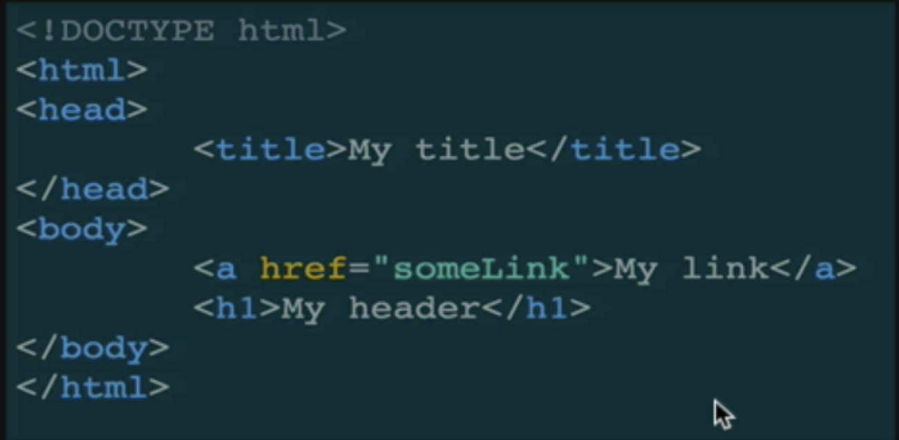
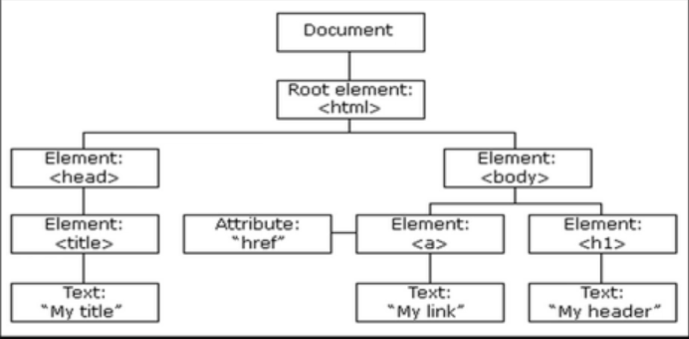

# The DOM
## Documemt Object Model
### The Document Object Model is the interface between your Javascript and HTML+CSS

* Objectives
  * Define what the DOM is 
  * Understand why the DOM manipulation is awesome
  * List a few examples of sites that use JS to manipualate the DOM
  * Understand the SELECT, then Manipulate workflow

The browser turns every HTML tag into a Javascript object that we can manipulate |
-------------------------------------------------------------------------------- | -----------------------------------------------
 What you see | 
Everything is stored inside the document object | 

# The Process
## SELECT an element and then MANIPULATE

### For our example, we'll change `<h1>` color using JS

BEFORE | AFTER 
------------------------------------------------------------------- | ---------------------------------------------------------------------------------

# Selecting
## One way to select

    ```javascript
    var h1 = document.querySelector("h1");
    ```


# Manipulating
## All sorts of things can be manipulated

    ```javascript
    var h1 = document.querySelector("h1");
    h1.style.color = "pink";
    ```

#### MANIPULATE using the `<h1>` we selected


## One more example
### SELECT the `<body>` and change its color every second

    ```javascript
    var body = document.querySelector("body");  //SELECT
    var isBlue = false;
    ```

    ```javascript
    setInterval(function() {
        if(isBlue) {
            body.style.background = "white";
        } else {
            body.style.background = "#3498db"
        }
        isBlue = !isBlue;
    }, 1000);
    ```