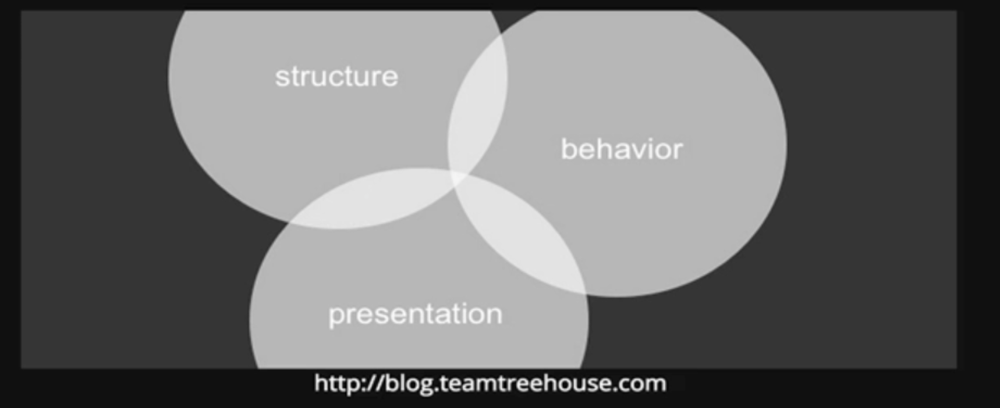

# Style
### The style property is one way to manipulate an element's style

```javascript
//SELECT
var tag = document.getElementById("highlight");

//MANIPULATE
tag.style.color = "blue"
tag.style.border = "10px solid red";
tag.style.fontSize = "70px";
tag.style.background = "yellow";
tag.style.marginTop = "200px";
```
## This is not DRY and a bad idea. 
### It is recommended for styles to be defined in a seperate file or files. The style property allows for quick styling, for example MDN.

## Separation of Concerns




# An Alternative
### Rather than directly manipulate style with JS, we can define a CSS class and then toggle it on or off with JS

```javascript
    var tag = document.getElementById("highlight");
    tag.style.colog = "blue"
    tag.style.border = "10px solid red";
```

```css
/* DEFINE A CLASS IN CSS */
.some-class {
    color: blue;
    border: 10px solid red;
}
```

```javascript
var tag = document.getElementById("highlight");
//ADD THE NEW CLASS TO THE SELECTED ELEMENT
tag.classList.add("some-class");
```